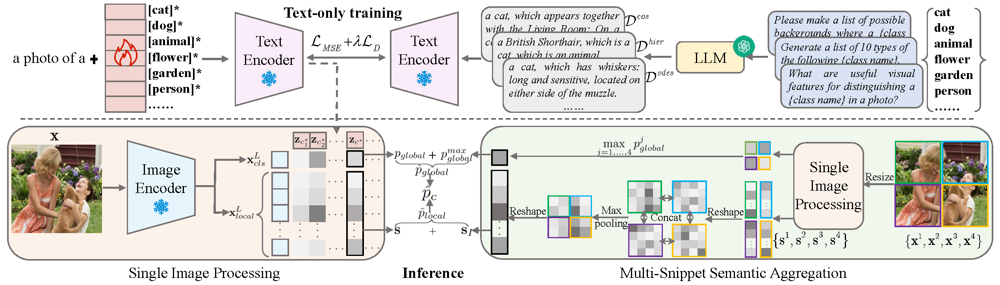

# Language-Driven Multi-Label Zero-Shot Learning with Semantic Granularity

Official PyTorch implementation of "Language-Driven Multi-Label Zero-Shot Learning with Semantic Granularity" [ICCV 2025](https://openaccess.thecvf.com/content/ICCV2025/html/Wang_Language-Driven_Multi-Label_Zero-Shot_Learning_with_Semantic_Granularity_ICCV_2025_paper.html)

> Recent methods learn class-unified prompt contexts by image data to adapt CLIP to zero-shot multi-label image classification, which achieves impressive performance.
However, simply tuning prompts is insufficient to deal with novel classes across different semantic granularity levels. This limitation arises due to the sparse semantic detail in prompt class names and the hierarchical granularity competition among class names caused by CLIP’s contrastive loss.
We propose a language-driven zero-shot multi-label learning framework to bridge associations among classes across multiple granularity levels through class name reconstruction. 
To achieve this, we first leverage a language model to generate structured text descriptions for each class, which explicitly capture (1) visual attributes, (2) hierarchical relationships, and (3) co-occurrence scenes.
With the enriched descriptions, we then learn class names by extracting and aligning semantic relationships and features from them in the CLIP’s shared image-text embedding space.
Furthermore, we consider that similar text descriptions among different classes may introduce ambiguities.
We mitigate these ambiguities by imposing a pair-based loss on learnable class names to enhance their distinctiveness.
During inference, we aggregate semantic predictions from multiple image snippets to reinforce the identification of classes across different granularity levels.
Comprehensive experiments demonstrate that our method surpasses state-of-the-art methods in multi-label zero-shot learning and effectively handles novel classes across different granularity levels.

## Pipeline


## Data Preparation

Final folder structure should be

```

IMG_PATH
└── val2014

ANNO_PATH (coco_text.yaml)
├── cls_idx.pickle
├── instances_val2014_gzsi_48_17.json
└── instances_val2014_unseen_48_17.json

IMG_PATH (Flickr)
├── actor
├── ...
└── zoos

ANNO_PATH (nuswide_text.yaml)
├── TagList1k.txt
├── Concepts81.txt
├── test_seen_labels.pkl
└── test_unseen_labels.pkl

TEXT_PATH
├── mscoco_post_llm.json
└── nuswide_post_llm.json
```

### MS-COCO

- [Download MS-COCO data from official website](https://cocodataset.org/)

### NUS-WIDE

- [Download NUS-WIDE data from official website](https://lms.comp.nus.edu.sg/wp-content/uploads/2019/research/nuswide/NUS-WIDE.html)

## Training and Evaluation

``` shell
bash coco.sh
```

or

```
bash nuswide.sh
```

## Citation
If you find it helpful, please consider citing
```bibtex
@inproceedings{wang2025language,
  title={Language-Driven Multi-Label Zero-Shot Learning with Semantic Granularity},
  author={Wang, Shouwen and Wan, Qian and Gao, Junbin and Zeng, Zhigang},
  booktitle={Proceedings of the IEEE/CVF International Conference on Computer Vision},
  pages={1968--1978},
  year={2025}
}
```